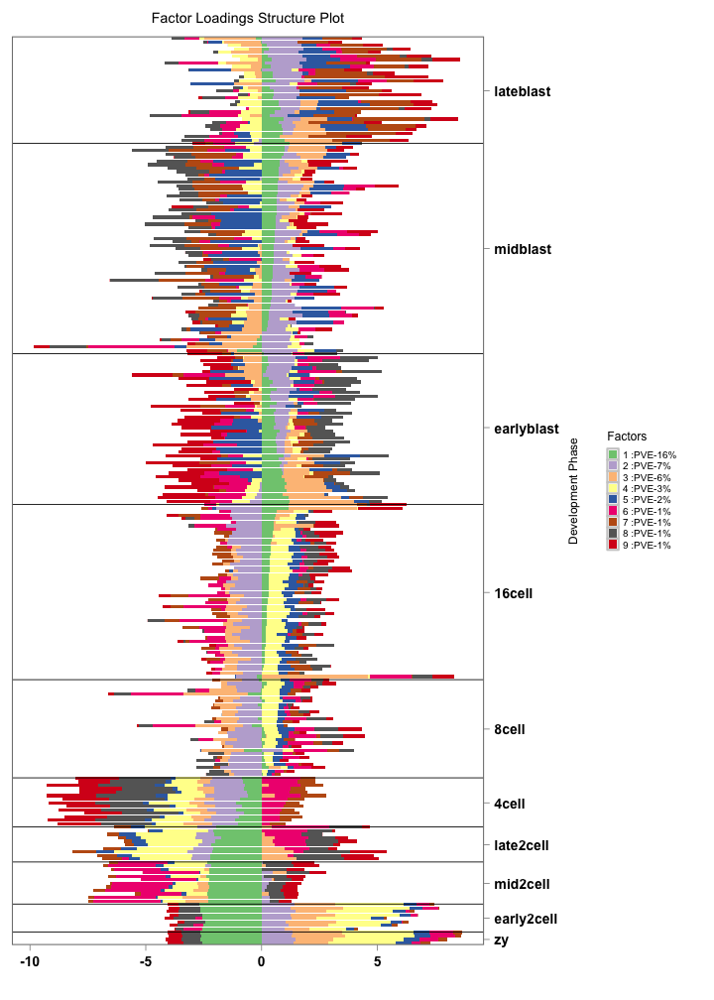
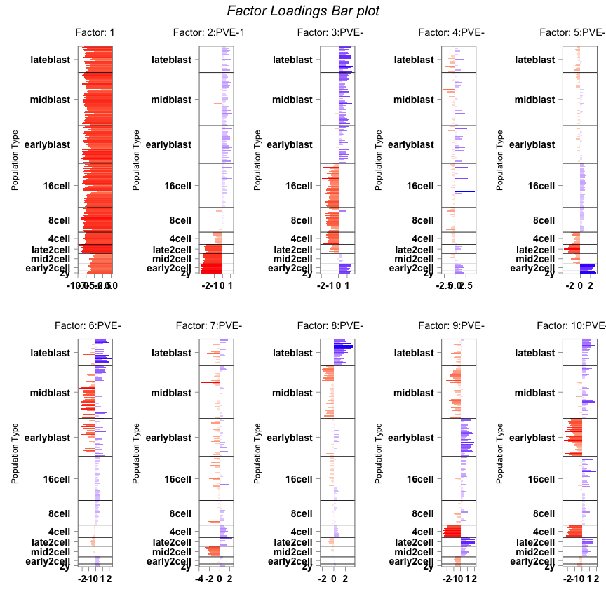

<!-- README.md is generated from README.Rmd. Please edit that file -->
flashr
======

Repo for flashr R package: Factor Loading Adaptive SHrinkage for matrix and tensor data.

Installation
============

To install dependencies, run in R:

``` r
install.packages(c("irlba", "tensr", "devtools"))
devtools::install_github("stephens999/ashr", ref = "uni")
```

The "uni" branch of the ashr package is required to use any mixing distribution other than a normal.

Because this is currently a private repo, to install flashr you will need a private access token (PAT) which you can generate here: <https://github.com/settings/tokens>

Then you can run in R:

``` r
devtools::install_github("stephenslab/flashr", auth_token = "xxx")
```

where you replace `xxx` with your PAT.

To get help ??flashr

Application of FLASH
====================

We load the *flashr* package

``` r
library(flashr)
#> Loading required package: Rcpp
#> Loading required package: RcppArmadillo
```

``` r
library(singleCellRNASeqMouseDeng2014)
#> Loading required package: Biobase
#> Loading required package: BiocGenerics
#> Loading required package: parallel
#> 
#> Attaching package: 'BiocGenerics'
#> The following objects are masked from 'package:parallel':
#> 
#>     clusterApply, clusterApplyLB, clusterCall, clusterEvalQ,
#>     clusterExport, clusterMap, parApply, parCapply, parLapply,
#>     parLapplyLB, parRapply, parSapply, parSapplyLB
#> The following objects are masked from 'package:stats':
#> 
#>     IQR, mad, xtabs
#> The following objects are masked from 'package:base':
#> 
#>     anyDuplicated, append, as.data.frame, as.vector, cbind,
#>     colnames, do.call, duplicated, eval, evalq, Filter, Find, get,
#>     grep, grepl, intersect, is.unsorted, lapply, lengths, Map,
#>     mapply, match, mget, order, paste, pmax, pmax.int, pmin,
#>     pmin.int, Position, rank, rbind, Reduce, rownames, sapply,
#>     setdiff, sort, table, tapply, union, unique, unlist, unsplit
#> Welcome to Bioconductor
#> 
#>     Vignettes contain introductory material; view with
#>     'browseVignettes()'. To cite Bioconductor, see
#>     'citation("Biobase")', and for packages 'citation("pkgname")'.
deng.counts <- exprs(Deng2014MouseESC)
deng.meta_data <- pData(Deng2014MouseESC)
deng.gene_names <- rownames(deng.counts)
```

We apply the greedy version of FLASH with the variances determined by the voom weights.

``` r
ll_deng <- flash.greedy(voom_data, K=10, flash_para = list(tol=1e-3, maxiter_r1 = 50,
                partype="known", sigmae2_true = voom_weights,
                nonnegative=FALSE));
```

Processing the factors obtained to check the proportion of variance explained by each factor as well as sparsity and other related features of factors the user may be interested in.

``` echo
postprocess_ll <- flash_factor_postprocess(ll_deng$l,ll_deng$f, voom_data)
pve_percentage <- postprocess_ll$PVE*100
```

The user can visualize the loadings using the stacked Barchart representation through the function *FactorGGStack* or through multi panel bar chart plot via *FactorGGBar* functionalities.

``` r
omega <- ll_deng$l

annotation <- data.frame(
  sample_id = paste0("X", c(1:NROW(omega))),
  label = factor(deng.meta_data$cell_type,
                        levels = c("zy", "early2cell",
"mid2cell", "late2cell","4cell", "8cell", "16cell","earlyblast","midblast","lateblast") ) )

rownames(omega) <- annotation$sample_id

FactorGGStack(loadings = omega[,-1],
                annotation = annotation,
                palette = c(RColorBrewer::brewer.pal(8, "Accent"),RColorBrewer::brewer.pal(4, "Spectral")),
                yaxis_label = "Development Phase",
                order_sample = TRUE,
                figure_title = "Factor Loadings Structure Plot",
                legend_labels = pve_percentage[-1],
                scale=TRUE,
                axis_tick = list(axis_ticks_length = .1,
                                 axis_ticks_lwd_y = .1,
                                 axis_ticks_lwd_x = .1,
                                 axis_label_size = 7,
                                 axis_label_face = "bold"))
```



``` r
FactorGGBar(loadings = omega,
            annotation = annotation,
            palette = list("mid"="white",
                           "low"="red",
                           "high"="blue",
                           "midpoint"=0),
            yaxis_label = "Population Type",
            figure_title = " ",
            axis_tick = list(axis_ticks_length = .1,
                             axis_ticks_lwd_y = .1,
                             axis_ticks_lwd_x = .1,
                             axis_label_size = 7,
                             axis_label_face = "bold"),
            legend_labels=pve_percentage,
            scale=TRUE,
            panel=list(panel_rows=2,
                       panel_title="Factor Loadings Bar plot",
                       panel_title_fontsize=10,
                       panel_title_font=3))
```



The top distinguishing features separating the factors can be extracted as follows

``` r
ll_f_scale <- apply(ll_deng$f[,-1],2,function(x)
                                  {
                                      if(sd(x)!=0) {return (x/sd(x))}
                                      else {return (x)}
    })

normalize <- function(x) { return (x/sum(x))}

abs_f_scale <- apply(ll_deng$f[,-1],2,function(x) normalize(abs(x)))
indices <- CountClust::ExtractTopFeatures(abs_f_scale, top_features=100, method="poisson", options="min")
imp_features <- apply(indices, c(1,2), function(x) deng.gene_names[x])

imp_features[1:6,1:6]
#>      [,1]      [,2]     [,3]            [,4]            [,5]     [,6]    
#> [1,] "Kit"     "Dgkk"   "Rnf141"        "Reep2"         "Fam46b" "Ston2" 
#> [2,] "Arl6ip5" "Gm6981" "Aagab"         "Clasp1"        "Top2b"  "Hbs1l" 
#> [3,] "Zfp772"  "Cd34"   "Herc6"         "Atm"           "Wee1"   "Fam64a"
#> [4,] "Ankrd35" "H2-Q10" "1600025M17Rik" "Loxl2"         "H2-T24" "Mmp19" 
#> [5,] "Lpcat4"  "Amotl2" "Smpdl3a"       "Lrrc2"         "Dusp14" "Fam65a"
#> [6,] "Smg1"    "Eif5a"  "Zfp706"        "2310003F16Rik" "Srsf10" "Hdlbp"
```
